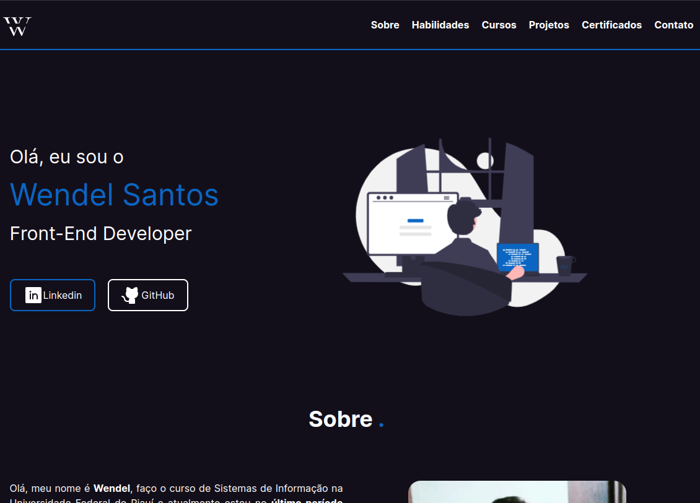

# Portfólio

<h4 align="center"> 
	Portfólio 
</h4>

<p align="center">
 <a href="#-sobre-o-projeto">Sobre</a> •
 <a href="#-funcionalidades">Funcionalidades</a> •
 <a href="#-layout">Layout</a> • 
 <a href="#-como-executar-o-projeto">Como executar</a> • 
 <a href="#-tecnologias">Tecnologias</a> 
</p>

---

## :ringed_planet: Sobre o projeto

O portfólio é um site que tem como objetivo mostrar um pouco sobre meus projetos e experiências durante a minha caminha no mundo da programação.

---

## 💻 Funcionalidades
 
- [x] Os usuários tem acesso site, onde podem:
  - [x] Visualizar os meus projetos, certificados e tecnologias já utilizada nos projetos;
  - [x] Mandar mensagem para o meu email.

---

## 🎨 Layout

<p align="center">
  
</p>

---

## 🚀 Como executar

### Pré-requisitos

Antes de começar, você vai precisar ter instalado em sua máquina as seguintes ferramentas:
[Git](https://git-scm.com), [Node.js](https://nodejs.org/en/). 

Além disto é bom ter um editor para trabalhar com o código como [VSCode](https://code.visualstudio.com/)

```bash

# Clone este repositório
$ git clone https://github.com/WendelSantosNunes/portfolio_v2_netxjs.git

# Instale as dependências
$ npm install

## ou
$ yarn install

# Execute a aplicação
npm run dev

## ou
yarn dev

```

---

## 🛠 Tecnologias

#### **Web**  ([React](https://react.dev/)  +  [TypeScript](https://www.typescriptlang.org/))

-   **[Nextjs](https://nextjs.org/)**
-   **[Tailwindcss](https://tailwindcss.com/)**